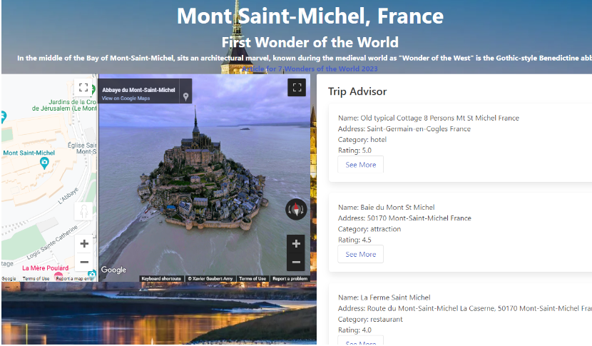

# Description

As a student in the U of M Full Stack Web Developer Bootcamp, it is important to prepare a professional portfolio on a live website. The professional portfolio is to showcase the work and web development skills gained from the Bootcamp. Future employers want to see the breadth of knowledge and skillset gained from the bootcamp. Hopefully the professional portfolio will give me the advantage when competing for future employement.

# Installation

Install web browser like Chrome, Firefox, Microsoft Edge to view the website.

# Usage

The following links are the images used in the website.

The profile picture shown on professional portfolio website:

# Credits

None

# License

MIT License
